# Sentio AI 邮件伙伴系统

> 基于推理增强型 LLM 的个性化记忆 AI 邮件伙伴系统

[](https://www.rust-lang.org)
[](https://www.mongodb.com)
[](LICENSE)

## 🎯 项目概述

Sentio 是一个智能邮件助手系统，具备以下核心能力：

- **🧠 深度记忆系统**: 维护用户的个人档案、交互历史和语义记忆
- **🤖 智能推理引擎**: 基于深度思考链（Chain of Thought）生成个性化回复
- **📧 邮件集成**: 完整的 SMTP 邮件发送和处理能力
- **🔍 可观测性**: 全链路日志记录和遥测数据收集
- **⚡ 高性能**: 异步架构，支持高并发场景

## 🏗️ 系统架构

```mermaid
graph TD
    subgraph "Sentio 服务架构"
        Core("sentio_core<br/>(服务编排)")
        Memory("sentio_memory<br/>(记忆管理)")
        LLM("sentio_llm<br/>(LLM 集成)")
        Email("sentio_email<br/>(邮件发送)")
        Telemetry("sentio_telemetry<br/>(日志遥测)")
        Shared("shared_logic<br/>(共享配置)")

        Core --> Memory
        Core --> LLM
        Core --> Email
        Core --> Telemetry

        Memory --> Shared
        LLM --> Shared
        Email --> Shared
        Telemetry --> Shared
        Core --> Shared

        Memory --> D1[(MongoDB)]
        LLM --> D2[(DeepSeek API)]
        Email --> D3[(SMTP Server)]
    end
```



### 服务特性

| 服务 | 功能 | 技术栈 |
|------|------|--------|
| **memory** | 用户记忆管理、交互历史存储 | MongoDB, BSON, 异步 |
| **llm** | LLM 调用、推理引擎 | DeepSeek API, 重试机制 |
| **email** | 邮件发送、SMTP 客户端 | Tokio, Native-TLS |
| **telemetry** | 日志、指标、链路追踪 | Tracing, Structured Logging |
| **core** | 业务协调、服务编排 | Tokio, 配置驱动 |

## 🚀 快速开始

### 环境要求

- **Rust**: 1.70+ (推荐使用 rustup)
- **MongoDB**: 4.4+ (本地或云端)
- **API 密钥**: DeepSeek 或其他 LLM 服务

### 安装步骤

1. **克隆项目**

   ```bash
   git clone <repository-url>
   cd sentio
   ```

2. **配置环境**

   ```bash
   cp .env.example .env
   # 编辑 .env 文件配置数据库和 API 密钥
   ```

3. **配置提示词**

   系统使用 `config/prompts.yaml` 管理所有 LLM 提示词：

   ```yaml
   prompts:
     email_analysis:
       default:
         system: "你是一位专业的邮件内容分析助手..."
         user: "请分析以下邮件内容: {email_body}"
   ```

4. **启动 MongoDB (可选)**

   ```bash
   # 使用 Docker
   docker run -d -p 27017:27017 --name sentio-mongo mongo:5.0
   
   # 或使用本地安装的 MongoDB
   mongod --dbpath /your/db/path
   ```

5. **构建和测试**

   ```bash
   # 构建项目
   cargo build --workspace
   
   # 运行测试
   cargo test --workspace
   ```

6. **运行系统**

   ```bash
   # 运行核心服务
   cargo run -p sentio_core
   
   # 或使用 watch 模式进行开发
   cargo watch -x "run -p sentio_core"
   ```

### 配置说明

系统支持通过配置文件和环境变量进行配置，环境变量具有更高优先级。

#### 核心配置项

| 配置项 | 环境变量 | 默认值 | 说明 |
|--------|----------|--------|------|
| 数据库 URL | `SENTIO_DATABASE__URL` | `mongodb://localhost:27017/sentio` | MongoDB 连接 |
| LLM API 密钥 | `SENTIO_LLM__API_KEY` | `your-api-key` | DeepSeek API 密钥 |
| 日志级别 | `SENTIO_TELEMETRY__LOG_LEVEL` | `info` | 日志详细程度 |
| 提示词配置 | - | `config/prompts.yaml` | LLM 提示词模板 |

#### 环境变量示例

```bash
# .env 文件示例
SENTIO_DATABASE__URL=mongodb://localhost:27017/sentio
SENTIO_LLM__API_KEY=sk-your-deepseek-api-key
SENTIO_LLM__MODEL=deepseek-chat
SENTIO_TELEMETRY__LOG_LEVEL=debug

# SMTP 邮件配置
SENTIO_EMAIL__SMTP__HOST=smtp.gmail.com
SENTIO_EMAIL__SMTP__PORT=587
SENTIO_EMAIL__SMTP__USERNAME=your-email@gmail.com
SENTIO_EMAIL__SMTP__PASSWORD=your-app-password
```

## 📚 功能特性

### 🧠 记忆系统

- **个人档案管理**: 用户基本信息、关系网络、性格特征
- **交互历史**: 完整的邮件交互记录和情感分析
- **语义记忆**: 用户偏好、习惯模式、重要事件
- **行动记忆**: 待办事项、未来计划、跟进提醒
- **策略记忆**: AI 假设、沟通策略、自我反思

### 🤖 智能引擎

- **配置驱动**: 所有 LLM 提示词外部化管理，支持热更新
- **模板渲染**: 支持 `{variable}` 占位符的动态内容替换
- **多功能模块**: 邮件分析、智能回复、推理链等预置功能
- **深度推理**: Chain of Thought 思考链生成
- **个性化回复**: 基于用户画像的定制化响应
- **情感分析**: 识别和适应用户情感状态
- **上下文理解**: 维护长期对话上下文

### 📧 邮件集成

- **SMTP 发送**: 支持主流邮件服务商
- **富文本支持**: HTML 邮件格式
- **附件处理**: 文件附件发送
- **错误处理**: 重试机制和失败通知

### 🎛️ LLM 配置驱动使用

#### 配置提示词

在 `config/prompts.yaml` 中定义提示词模板：

```yaml
prompts:
  email_analysis:
    default:
      system: >
        你是一位专业的邮件内容分析助手。请以JSON格式返回分析结果。
      user: >
        请分析以下邮件内容:
        """
        {email_body}
        """
        
        返回JSON结构: {"sentiment": "...", "summary": "...", "key_points": [...]}
        
  smart_reply:
    professional:
      system: "你是一个专业的商务助手。"
      user: "为以下邮件生成专业回复: {email_body}"
    casual:
      system: "你是一个友好的AI助手。"  
      user: "为以下邮件生成友好回复: {email_body}"
```

#### 代码中使用

```rust
use sentio_llm::{LlmClient, LlmRequest, DeepSeekClient};
use serde_json::json;
use std::collections::HashMap;

// 创建客户端
let client = DeepSeekClient::new()?;

// 准备上下文变量
let mut context = HashMap::new();
context.insert("email_body".to_string(), json!("用户的邮件内容..."));

// 使用配置化的提示词发起请求
let request = LlmRequest::new("email_analysis.default".to_string(), context);
let response = client.generate_response(&request).await?;

println!("分析结果: {}", response.content);
```

#### 支持的变量类型

- **字符串变量**: `{email_body}`, `{user_name}`, `{subject}`
- **JSON 数据**: `{data}`, `{context}`, `{metadata}`
- **数组内容**: `{items}`, `{list}`, `{options}`
- **复杂对象**: 自动序列化为 JSON 字符串

## � 服务文档

| 服务 | 文档链接 | 功能描述 |
|------|----------|----------|
| **Core** | [README](services/core/README.md) | 主程序和服务协调 |
| **Memory** | [README](services/memory/README.md) | 记忆数据管理 |
| **LLM** | [README](services/llm/README.md) | 语言模型集成 |
| **Email** | [README](services/email/README.md) | 邮件发送服务 |
| **Telemetry** | [README](services/telemetry/README.md) | 日志和监控 |
| **Shared Logic** | [README](services/shared_logic/README.md) | 配置和工具 |

## 🛠️ 开发指南

### 项目结构

```text
sentio/
├── services/
│   ├── core/              # 核心业务逻辑
│   ├── memory/            # 记忆服务 (MongoDB)
│   ├── llm/               # LLM 服务集成
│   ├── email/             # 邮件发送服务
│   ├── telemetry/         # 遥测和日志
│   └── shared_logic/      # 共享配置和类型
├── docs/                  # 项目文档
├── target/                # 构建输出
├── Cargo.toml            # 工作空间配置
├── .env.example          # 环境变量模板
└── README.md             # 项目说明
```

### 构建和测试

```bash
# 完整构建
cargo build --workspace

# 运行所有测试
cargo test --workspace

# 运行特定服务测试
cargo test -p sentio_memory

# 代码质量检查
cargo clippy --workspace -- -D warnings

# 代码格式化
cargo fmt --workspace

# 生成文档
cargo doc --workspace --open
```

### 添加新功能

1. **创建新服务**:

   ```bash
   mkdir services/new_service
   cd services/new_service
   cargo init --lib
   ```

2. **更新工作空间配置**:

   ```toml
   # Cargo.toml
   [workspace]
   members = [
       "services/new_service",
       # ... 其他服务
   ]
   ```

3. **添加依赖和实现功能**

### 测试策略

- **单元测试**: 每个服务的核心逻辑
- **集成测试**: 服务间交互和 API 调用
- **端到端测试**: 完整的业务流程验证

## 🚀 部署

### 生产环境部署

1. **环境准备**:

   ```bash
   # 安装 MongoDB
   # 配置 SMTP 服务
   # 准备 LLM API 密钥
   ```

2. **构建发布版本**:

   ```bash
   cargo build --release --workspace
   ```

3. **配置生产环境变量**:

   ```bash
   export SENTIO_DATABASE__URL="mongodb://prod-host:27017/sentio"
   export SENTIO_LLM__API_KEY="your-production-api-key"
   export SENTIO_TELEMETRY__LOG_LEVEL="info"
   ```

4. **启动服务**:

   ```bash
   ./target/release/sentio_core
   ```

### Docker 部署 (计划中)

```dockerfile
# 多阶段构建，优化镜像大小
FROM rust:1.70 as builder
# ... 构建配置

FROM debian:bookworm-slim
# ... 运行时配置
```

## 🤝 贡献指南

### 代码贡献

1. Fork 项目并创建特性分支
2. 确保代码通过所有测试和 lint 检查
3. 添加适当的测试和文档
4. 提交 Pull Request

### 开发规范

- 遵循 Rust 社区标准 (cargo fmt, clippy)
- 为新功能添加测试
- 更新相关文档
- 使用语义化版本管理

## 📄 许可证

本项目采用 MIT 许可证 - 详见 [LICENSE](LICENSE) 文件。

## 🙏 致谢

- [Tokio](https://tokio.rs/) - 异步运行时
- [MongoDB](https://www.mongodb.com/) - 数据存储
- [DeepSeek](https://www.deepseek.com/) - LLM 服务
- [Tracing](https://tracing.rs/) - 结构化日志

---

**Sentio AI** - 让邮件沟通更智能，让关系维护更高效 🚀

```text
邮件接收 → 内容解析 → 记忆检索 → LLM 推理 → 回复生成 → 邮件发送
     ↓
记忆更新 ← 交互记录 ← 策略调整 ← 反思分析 ←
```

## 🤝 贡献

欢迎贡献代码！请确保：

1. 遵循项目的代码风格和命名约定
2. 为新功能添加相应的测试
3. 更新相关文档
4. 提交前运行 `cargo clippy` 和 `cargo fmt`

## 📄 许可证

本项目采用 MIT 许可证 - 详见 [LICENSE](LICENSE) 文件。

## ⭐ 致谢

- [DeepSeek](https://www.deepseek.com/) - 提供强大的 LLM API
- [Tokio](https://tokio.rs/) - 异步运行时
- [Serde](https://serde.rs/) - 序列化框架
- [Tracing](https://tracing.rs/) - 结构化日志
