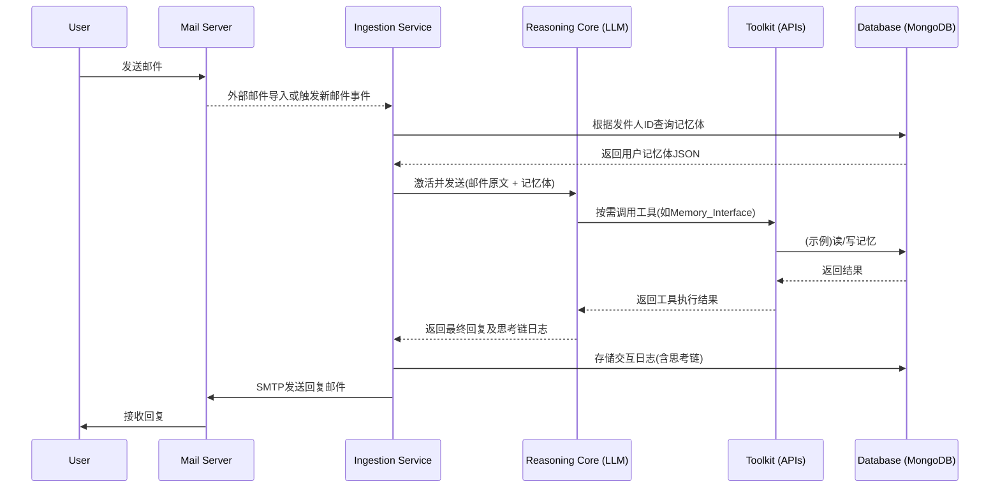

# Sentio AI 统一技术文档

**最后更新**: 2025年6月23日  
**文档版本**: v3.0

---

## 1. 🎯 项目概述

Sentio 是一个基于推理增强型 LLM 的个性化记忆 AI 邮件伙伴系统，具备以下核心能力：

- **🧠 深度记忆系统**: 维护用户的个人档案、交互历史和语义记忆
- **🤖 智能推理引擎**: 基于深度思考链（Chain of Thought）生成个性化回复
- **📧 邮件集成**: 完整的 SMTP 邮件发送和处理能力
- **🔍 可观测性**: 全链路日志记录和遥测数据收集
- **⚡ 高性能**: 异步架构，支持高并发场景

### 1.1 核心哲学

从“有状态的同伴”到“**有洞察的知己**”。系统追求前瞻性（Proactive）与深刻性（Insightful），致力于成为用户的数字化灵魂伴侣。

### 1.2 项目阶段

**核心功能完成，生产就绪**

---

## 2. 🏗️ 系统架构

### 2.1 服务概览

系统采用微服务架构，将不同的功能模块解耦，便于独立开发、部署和扩展。

```text
services/
├── core/             # 核心服务和主程序入口
├── memory/           # 记忆服务 (MongoDB 后端)
├── llm/              # LLM 服务 (DeepSeek 等)
├── email/            # 邮件服务 (SMTP 发送)
├── telemetry/        # 遥测和日志服务
└── shared_logic/     # 共享逻辑和配置管理
```

### 2.2 服务特性

| 服务 | 功能 | 技术栈 |
|---|---|---|
| **memory** | 用户记忆管理、交互历史存储 | MongoDB, BSON, 异步 |
| **llm** | LLM 调用、推理引擎 | DeepSeek API, 重试机制 |
| **email** | 邮件发送、SMTP 客户端 | Tokio, Native-TLS |
| **telemetry** | 日志、指标、链路追踪 | Tracing, Structured Logging |
| **core** | 业务协调、服务编排 | Tokio, 配置驱动 |

### 2.3 架构流程图



### 2.4 组件职责

- **Ingestion Service**: 系统的入口和调度中心。负责监听邮件、管理与数据库和推理核心的通信、格式化数据、记录日志。
- **Database**: 持久化存储层。负责存储所有用户的记忆体和完整的交互日志。
- **Reasoning Core**: 系统核心。执行所有非确定性任务，包括分析、推理、规划、生成和自我批判。
- **Toolkit**: 为推理核心提供与外部世界交互的确定性能力。

---

## 3. ✅ 功能与状态

### 3.1 已完成功能

- **核心服务架构 (100%)**: 微服务架构、统一配置、错误处理、结构化日志。
- **记忆服务 (100%)**: MongoDB 集成、完整数据模型、仓储模式、性能优化。
- **LLM 服务 (100%)**: DeepSeek API 集成、重试机制、流式处理、Token 计数。
- **邮件服务 (100%)**: SMTP 客户端、TLS/SSL 加密、富文本支持、发送验证。
- **遥测服务 (100%)**: 结构化日志、多级别输出、性能监控、错误追踪。
- **配置系统 (100%)**: 环境变量与 TOML 文件支持、启动时验证、全局安全访问。

### 3.2 测试状态

#### 单元测试覆盖率

| 服务 | 测试状态 | 覆盖功能 |
|---|---|---|
| **memory** | ✅ 4/4 通过 | 模型创建、序列化、仓储操作 |
| **email** | ✅ 2/2 通过 | 客户端创建、邮件验证 |
| **llm** | ✅ 编译通过 | API 调用、错误处理 |
| **telemetry** | ✅ 编译通过 | 日志初始化、格式化 |
| **shared_logic**| ✅ 编译通过 | 配置加载、类型验证 |
| **core** | ✅ 集成通过 | 服务协调、端到端流程 |

#### 集成测试结果

```bash
# 最新测试结果
running 6 tests
test test_interaction_log_creation ... ok
test test_message_direction_serialization ... ok
test test_interaction_log_serialization ... ok
test mock_tests::test_mock_repository_basic_operations ... ok
test test_smtp_client_creation ... ok
test test_email_validation ... ok

test result: ok. 6 passed; 0 failed; 0 ignored
```

---

## 4. 💾 数据模型

### 4.1 记忆体 (Memory Corpus) 结构

每个用户对应一个 JSON 文档，用于持久化存储所有相关记忆。

```json
{
  "userId": "user.email@example.com",
  "version": "2.1",
  "createdAt": "YYYY-MM-DDTHH:MM:SSZ",
  "updatedAt": "YYYY-MM-DDTHH:MM:SSZ",
  "profile": {
    "name": "示例用户",
    "persona": "用户的核心身份和角色描述",
    "preferences": {
      "communicationStyle": "formal"
    }
  },
  "interactionHistory": [
    {
      "logId": "uuid-v4",
      "timestamp": "YYYY-MM-DDTHH:MM:SSZ",
      "message": {
        "direction": "Incoming",
        "content": "邮件原文摘要"
      }
    }
  ],
  "semanticMemory": [
    {
      "topic": "项目A",
      "content": "关于项目A的关键信息和上下文"
    }
  ]
}
```

---

## 5. 🚀 快速开始

### 5.1 环境要求

- **Rust**: 1.70+ (推荐使用 rustup)
- **MongoDB**: 4.4+ (本地或云端)
- **API 密钥**: DeepSeek 或其他 LLM 服务

### 5.2 安装与运行

1. **克隆项目**

   ```bash
   git clone <repository-url>
   cd sentio
   ```

2. **配置环境**

   ```bash
   cp .env.example .env
   # 编辑 .env 文件，填入数据库连接信息和 API 密钥
   ```

3. **构建与测试**

   ```bash
   # 构建所有服务
   cargo build --workspace
   
   # 运行所有测试
   cargo test --workspace
   ```

4. **运行系统**

   ```bash
   # 运行核心服务
   cargo run --bin sentio_core
   ```
